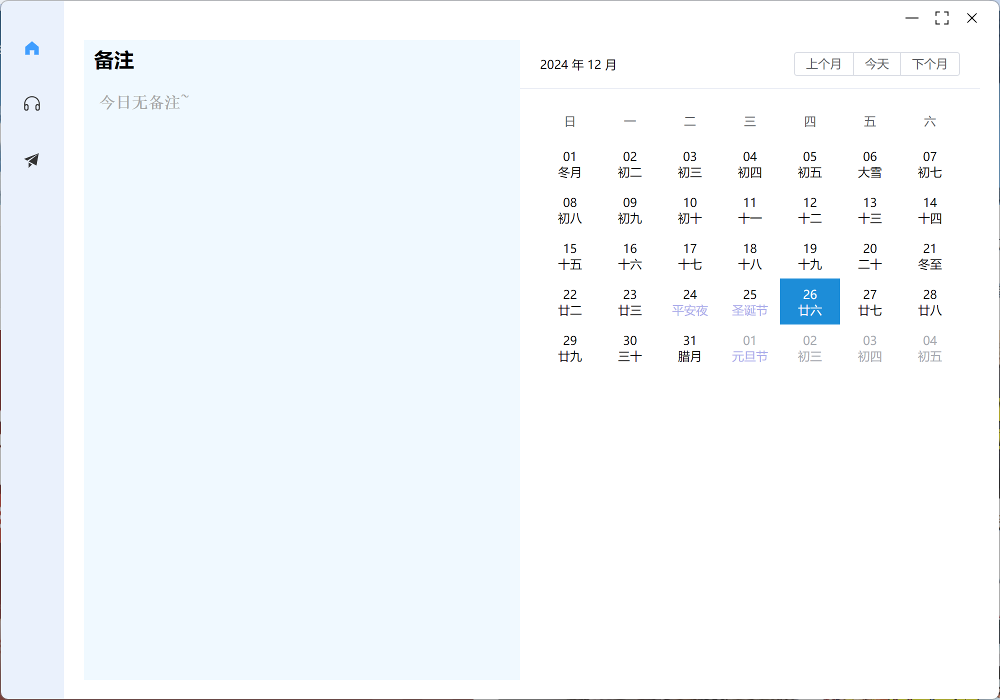
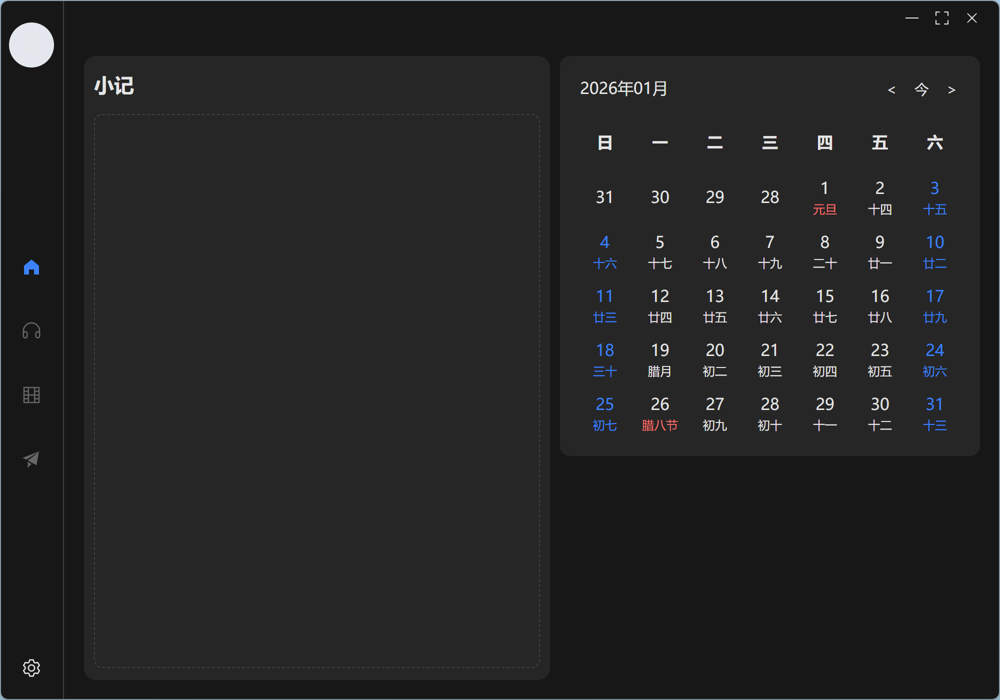
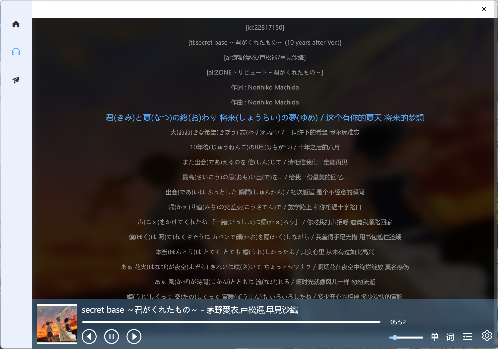
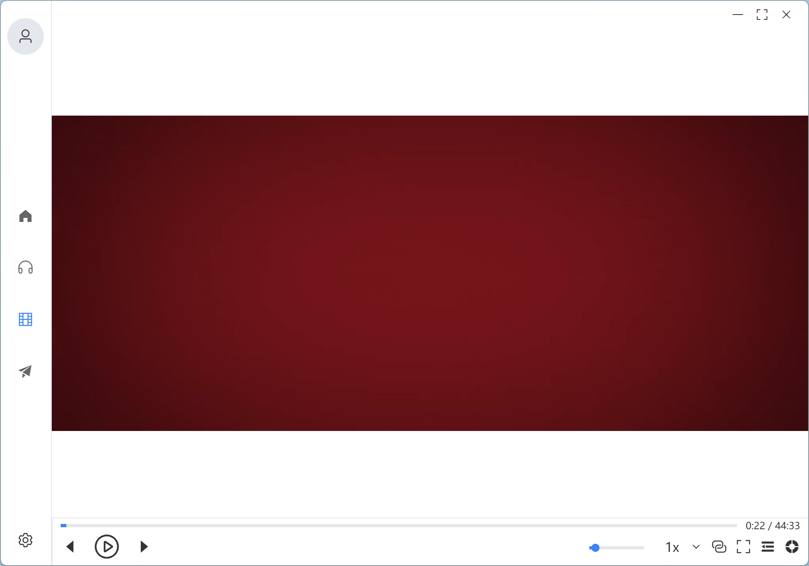
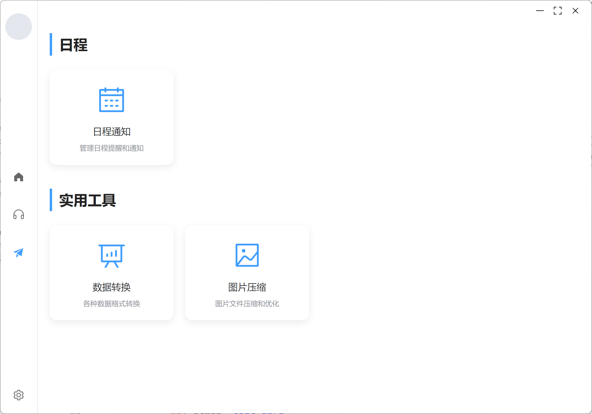

# electron-my-tools

项目使用 Electron 框架，Vue 3 作为前端框架，TypeScript 作为开发语言。

## Recommended IDE Setup

- [VSCode](https://code.visualstudio.com/) + [ESLint](https://marketplace.visualstudio.com/items?itemName=dbaeumer.vscode-eslint) + [Prettier](https://marketplace.visualstudio.com/items?itemName=esbenp.prettier-vscode) + [Volar](https://marketplace.visualstudio.com/items?itemName=Vue.volar) + [TypeScript Vue Plugin (Volar)](https://marketplace.visualstudio.com/items?itemName=Vue.vscode-typescript-vue-plugin)

## Project Setup

### Install

```bash
npm install
```

### Development

```bash
npm run dev
```

### Build

```bash
# For windows
npm run build:win

# For macOS
npm run build:mac

# For Linux
npm run build:linux
```

## Feature

**全局设置**

- [x] 主题切换（浅色模式/深色模式）




**音乐**

- [x] 本地音乐播放（播放、暂停、上一曲、下一曲、调整音量、调整播放进度）
- [x] 歌单管理（创建、删除、重命名歌单，添加、删除音乐到歌单）
- [x] 桌面歌词（显示当前播放音乐的歌词）



**视频**

- [x] 视频集合（添加、删除、重命名视频，添加、删除视频到集合）
- [x] 本地视频播放（播放、暂停、上一集、下一集、调整播放进度、倍速、全屏、画中画）



**工具**

- [x] 日程通知
- [ ] 待办事项列表
- [x] JSON数据格式化
- [x] 图片压缩
- [x] 颜色拾取



**其他**

待补充
